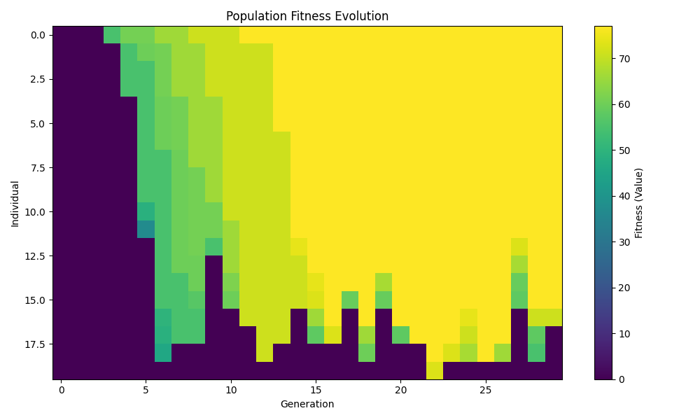
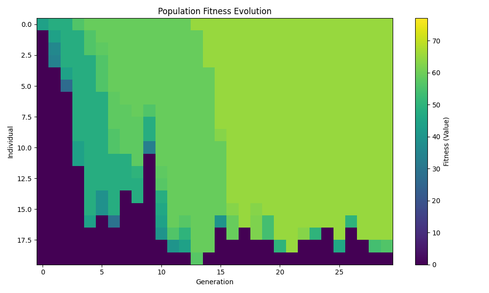

# Genetic-Knapsack

This small project is part of a course on Metaheuristics and is solely for learning purposes.

## Problem Statement

The goal is to solve the classic **Binary Knapsack Problem** using a genetic algorithm.  
Given a set of items, each with a value and a weight, the objective is to select a subset of items such that the total weight does not exceed a given limit and the total value is maximized.

## Why this project?

This project was developed as part of a course on Metaheuristics at Telecom Saint Etienne.  
It is intended for educational purposes, to experiment with and understand the behavior of genetic algorithms on combinatorial optimization problems.

## How the Genetic Algorithm Works

- **Chromosome Representation:** Each individual is a list of 0s and 1s, where each bit indicates whether the corresponding item is included in the knapsack.
- **Population:** A set of such individuals is maintained and evolved over generations.
- **Selection:** Tournament selection is used to choose parents for reproduction.
- **Crossover:** One-point crossover combines two parents to produce offspring.
- **Mutation:** Each bit in the chromosome can be flipped with a small probability.
- **Elitism:** The best individual of each generation is always carried over to the next generation.
- **Fitness Function:** The total value of the selected items, with a hard penalty (score 0) if the weight limit is exceeded.

## Parameters Used

- **Population size:** 20
- **Number of generations:** 30
- **Mutation rate:** 0.01
- **Tournament size:** 3
- **Maximum knapsack weight:** 15

## Usage
To run the genetic algorithm, execute the following command in the terminal:

```bash
python main.py
```

You can also specify the following optional arguments:
- `--population_size`: Size of the population (default: 20)
- `--num_generations`: Number of generations (default: 30)
- `--mutation_rate`: Mutation rate (default: 0.01)
- `--tournament_size`: Size of the tournament for selection (default: 3)
- `--max_weight`: Maximum weight of the knapsack (default: 15)
- `--visualize`: Generate a visualization of the population's fitness evolution over generations (default: False)
- `--exhaustive`: Perform an exhaustive search to find the optimal solution (default: False)
- `--seed`: Random seed for reproducibility (default: None)

Recommended usage for testing the algorithm:

```bash
python main.py --visualize --exhaustive --seed 75
```

## Data

The items are loaded from [`objects.csv`](objects.csv) (first row is a header):

## Example Result

After running the genetic algorithm, the best solution found is printed, along with its value and weight. Optionally, an exhaustive search can be performed to find the true optimal solution (feasible only for small item sets).

### Visualization

The following image shows the evolution of the population's fitness over generations.  
Each row corresponds to an individual, each column to a generation, and the color indicates the fitness (total value) of that individual at that generation.



*(If you run the code with `--visualize`, a similar image will be displayed at the end of execution.)*

*Note: The color scale is based on the optimal solution with the default parameters, we encourage users to run with the `exhaustive` option to find the optimal solution for their specific instance before visualizing.*

### Important Note: Heuristic Nature

The genetic algorithm is a **heuristic** method.  
This means it does not guarantee to find the optimal solution every time, especially for complex or large instances.  
It is designed to efficiently find good (often near-optimal) solutions in a reasonable time, but due to its stochastic nature and limited number of generations, it may sometimes miss the true optimum.  
For small instances, you can compare the genetic algorithm's result with the optimal solution found by exhaustive search.



